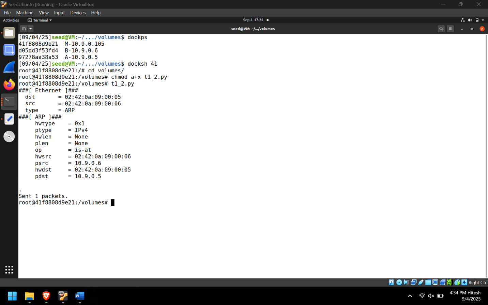
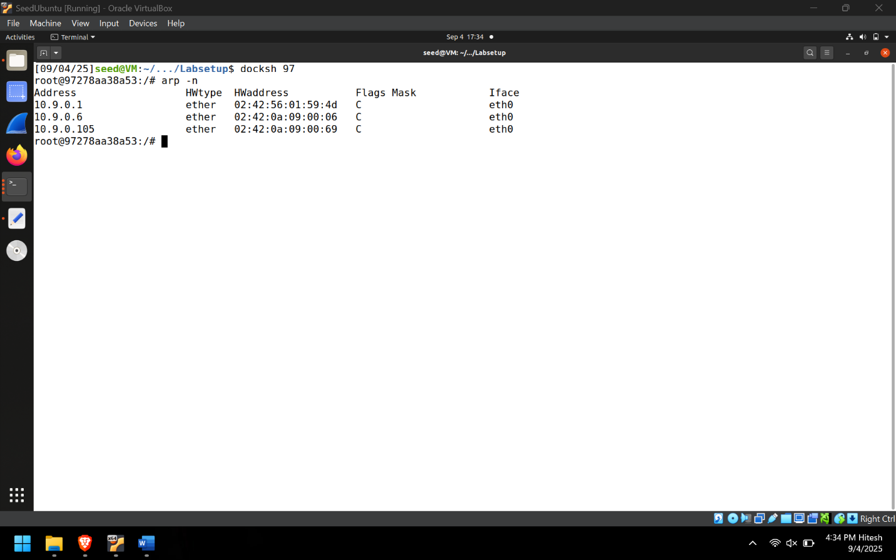
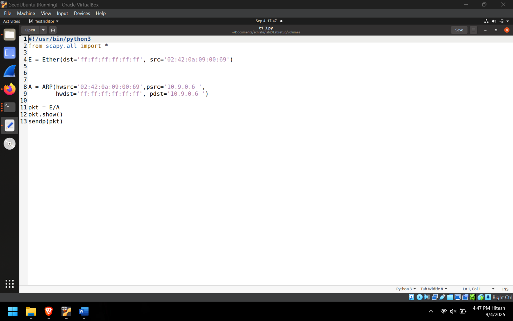
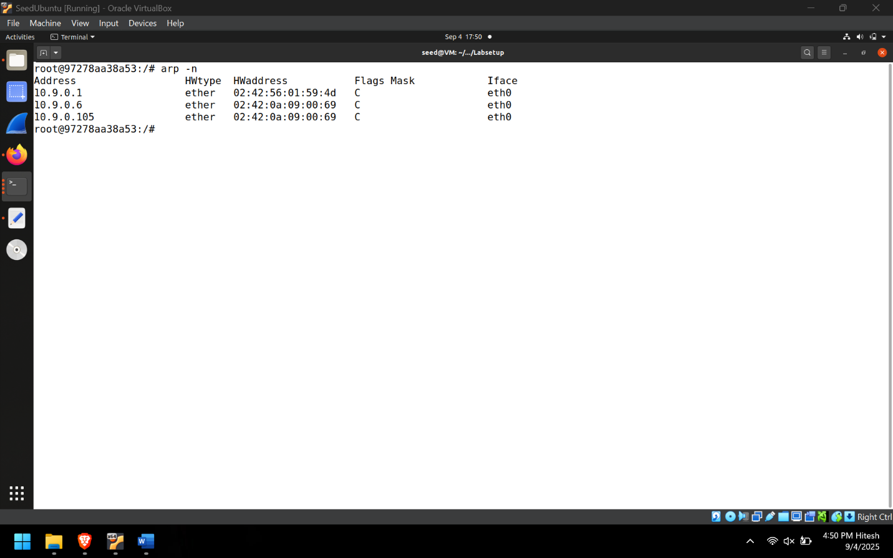
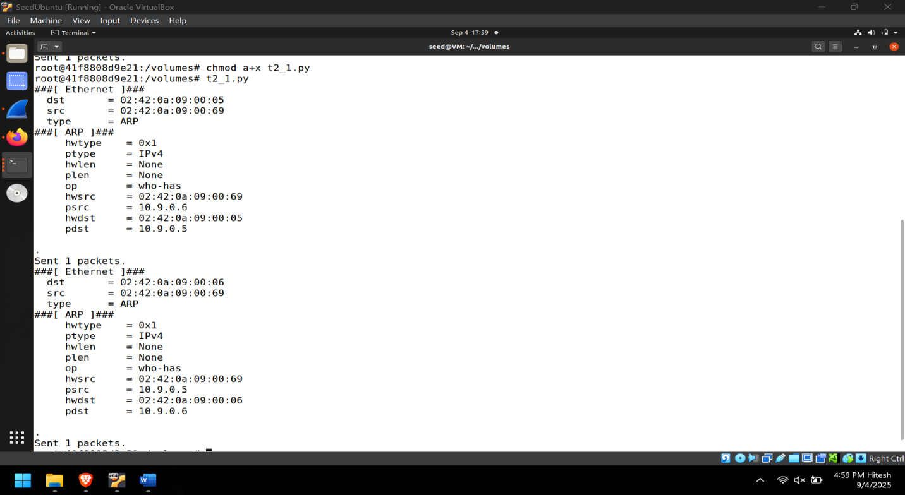
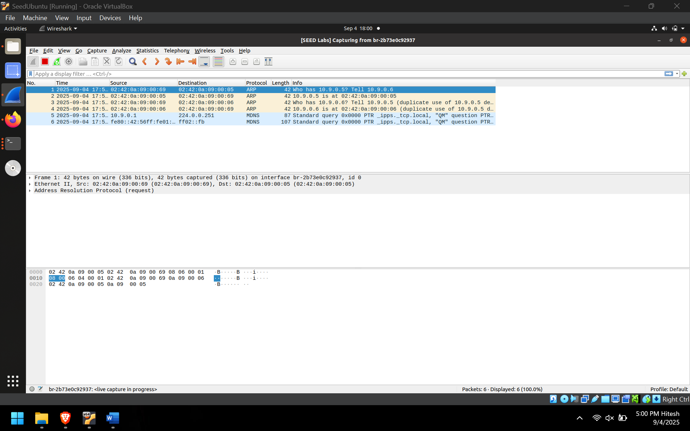
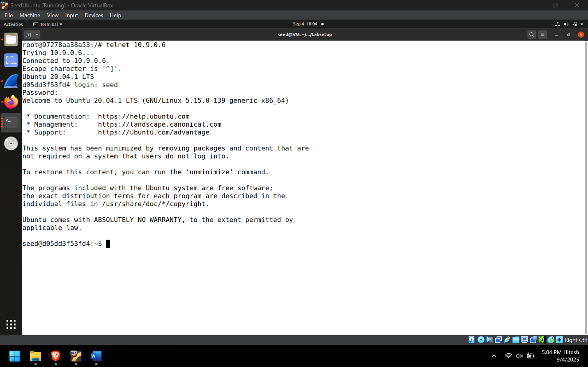
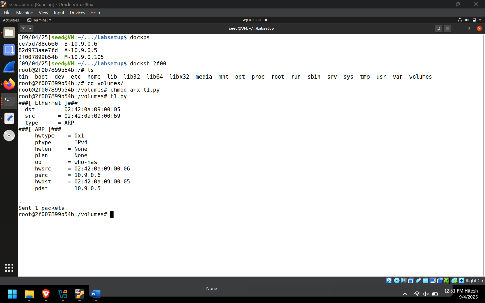
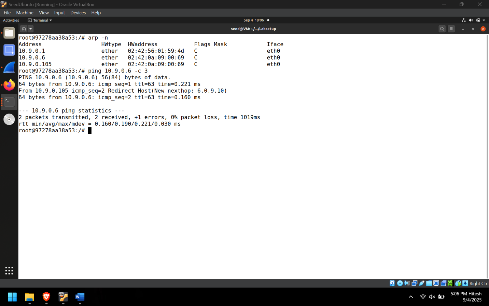
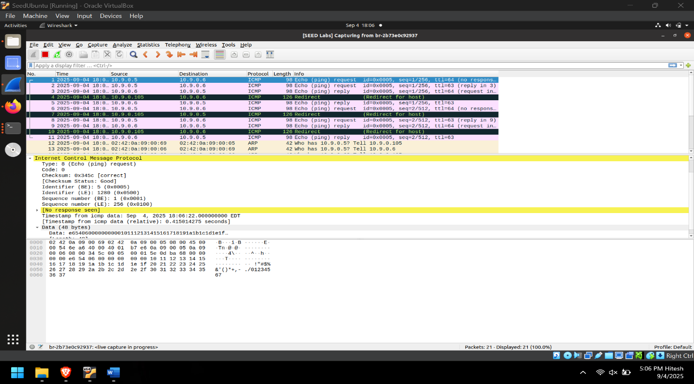

# 🔥 ARP Cache Poisoning & MITM Attack Lab

## 📌 Overview

This lab demonstrates how ARP cache poisoning can be used to perform Man-in-the-Middle (MITM) attacks in a local network.

Using Scapy, crafted ARP packets were sent to manipulate ARP caches of victim machines, redirecting traffic through the attacker machine. The lab explores multiple ARP poisoning techniques and demonstrates interception of Telnet and Netcat communications.

---

## 🎯 Objectives

- Understand ARP protocol behavior
- Perform ARP cache poisoning
- Poison hosts using ARP Requests
- Poison hosts using ARP Replies
- Poison hosts using Gratuitous ARP
- Establish a MITM position
- Forward intercepted traffic
- Analyze packets using Wireshark
- Intercept Telnet traffic
- Intercept Netcat communications

---

## 🛠️ Technologies Used

- Linux
- Python
- Scapy
- Wireshark
- Telnet
- Netcat
- TCP/IP Networking

---

# 🏗️ Lab Topology

| Device | IP Address |
|----------|----------|
| Attacker (M) | 10.9.0.105 |
| Victim A | 10.9.0.5 |
| Victim B | 10.9.0.6 |

---

# ARP Cache Poisoning

## ARP Request Spoofing

A forged ARP request was created using Scapy to convince Victim A that Victim B's IP address belonged to the attacker.

### ARP Request Code

### Execution Result

### Outcome

Victim A's ARP cache was successfully poisoned, mapping Victim B's IP address to the attacker's MAC address.

---

## ARP Reply Spoofing

An unsolicited ARP reply was sent to Victim A containing a forged IP-to-MAC mapping.

### ARP Reply Code

### Execution Result

### Outcome

The forged ARP reply updated the victim's ARP cache and redirected traffic through the attacker.

---

## Gratuitous ARP Poisoning

A gratuitous ARP packet was broadcast to advertise a fake ownership of Victim B's IP address.

### Gratuitous ARP Code

### Execution Result

### Outcome

Victim A accepted the forged ARP information and updated its cache accordingly.

---

# MITM Attack on Telnet

## Step 1 – Launch ARP Poisoning

Bidirectional ARP poisoning was performed so that:

- A mapped B → Attacker MAC
- B mapped A → Attacker MAC

### Poisoning Script

---

## Step 2 – Verify ARP Poisoning

Wireshark was used to observe forged ARP traffic and verify successful poisoning.

### Wireshark Capture

---

## Step 3 – Test Connectivity

A Telnet session was established between the victims while the attacker sat in the middle.

### Telnet Session

---

## Step 4 – Observe ICMP Redirect Messages

Because traffic was passing through the attacker, ICMP redirect messages were generated and observed in Wireshark.

### ICMP Redirect Capture

---

## Step 5 – Enable Packet Forwarding

The attacker enabled IP forwarding to relay packets between victims without interrupting communication.

### Attacker Terminal

---

## Step 6 – Execute MITM Script

A Scapy-based MITM script was used to intercept and manipulate Telnet traffic.

### MITM Script

---

# MITM Attack on Netcat

The same ARP poisoning technique was used to intercept Netcat communications.

### Netcat MITM Code

### Netcat Interception Result

### Outcome

Traffic exchanged through Netcat was intercepted and modified by the attacker before reaching the destination.

---

# 📊 Key Concepts Demonstrated

- ARP Cache Poisoning
- ARP Request Spoofing
- ARP Reply Spoofing
- Gratuitous ARP
- MITM Attacks
- Telnet Interception
- Netcat Interception
- Packet Crafting
- Packet Manipulation
- IP Forwarding
- Wireshark Analysis
- Scapy Automation

---

# 🔐 Security Impact

ARP poisoning enables attackers to place themselves between communicating hosts, allowing traffic interception, modification, credential theft, and session hijacking on unsecured networks.

Understanding these attacks helps defenders implement protections such as:

- Static ARP Entries
- Dynamic ARP Inspection (DAI)
- Port Security
- VLAN Segmentation
- Encrypted Protocols (SSH instead of Telnet)

---

# 📚 Learning Outcomes

By completing this lab, I gained hands-on experience with:

- ARP protocol internals
- Packet crafting using Scapy
- Traffic interception techniques
- MITM attack workflows
- Network traffic analysis using Wireshark
- Secure network design considerations

---

## ⚠️ Disclaimer

This project was conducted in a controlled educational lab environment for cybersecurity learning and research purposes only.
